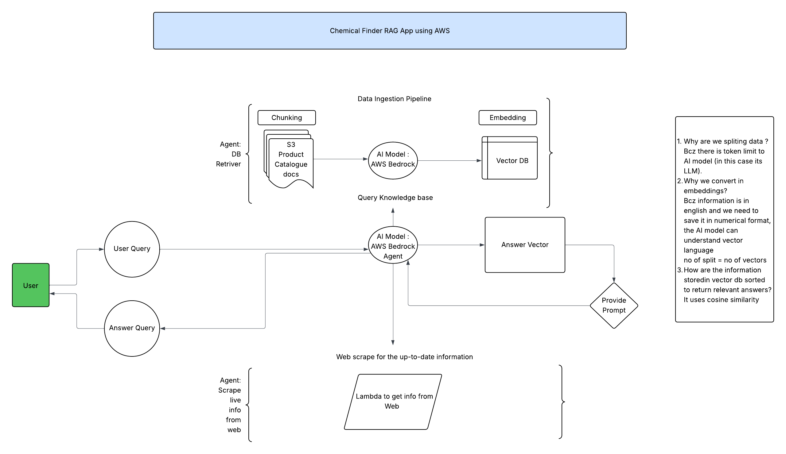

## Chemical Finder Application idea
We are building a Retrieval-Augmented Generation (RAG) application for Stepan Company that enables users to search for chemicals and formulations using natural language. Instead of relying on exact product names or technical filters, users can type queries like “a biodegradable surfactant for a high-foam dishwashing liquid” or “non-ionic emulsifier for agricultural spray applications.”
The system will:
Ingest and index Stepan’s product catalog, technical datasheets, and formulation guides in a vector database.

Use an LLM to understand user intent and retrieve the most relevant products.

Generate summaries explaining why each product matches, highlighting key properties, performance data, and regulatory notes.

This application will make it faster and easier for customers, sales teams, and formulators to find the right products, improving product discovery, reducing support requests, and streamlining decision-making.

## Problem Statement
Stepan Company maintains a large and complex catalog of specialty chemicals and formulations serving diverse markets, including cleaning products, personal care, agriculture, food, and industrial applications. Today, customers, sales teams, and formulators often struggle to quickly locate the right chemical ingredients that meet specific technical, regulatory, or performance criteria.
Existing search tools rely on keyword matching and static filters, which require users to know the exact product name, chemical class, or specification beforehand. This results in:
Inefficient Product Discovery: Users spend significant time browsing datasheets or contacting technical support to identify suitable products.

Missed Opportunities: Potential matches are overlooked when users lack familiarity with industry terminology or internal product naming conventions.

Poor User Experience: Non-technical users, such as new sales representatives or formulators, face a steep learning curve.

## Proposed Solution:

Build a Retrieval-Augmented Generation (RAG) application that allows users to search Stepan’s product catalog using natural language queries. By combining a vector database of product descriptions, technical datasheets, and formulation guides with a large language model (LLM), the system can:
Interpret user intent from natural language (e.g., “a biodegradable surfactant for dishwashing liquid with high foam”).

Retrieve the most relevant products and technical documents from Stepan’s catalog.

Generate clear, concise summaries of why each product matches the request, including key specifications, performance data, and regulatory notes.

This solution will improve product discovery, reduce support workload, and enable faster decision-making for customers and internal teams.
Data Sources
From the the URL below find “Product Bulletin” PDF files from the Product Finder page4 on Stepan Company - 
https://www.stepan.com/content/stepan-dot-com/en/products-markets/product-finder.html

